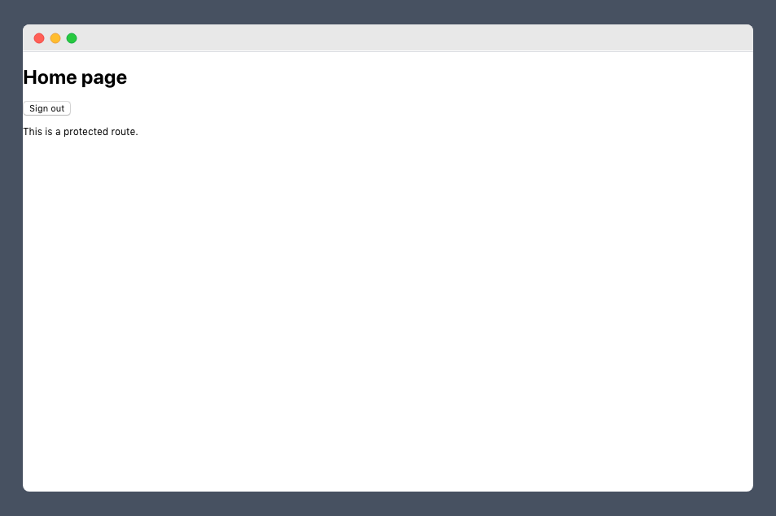

# React auth with Firebase

This is a bare-bones project that uses firebase authentication - It took me a few attempts to figure out how to best handle routing, and pass the state of if a user was authenticated to various components. 

